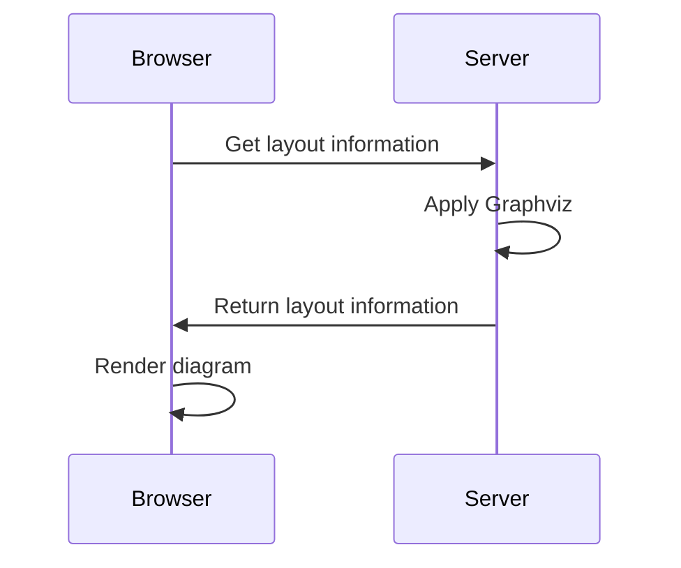

A static site for C4 diagrams from a [Structurizr](https://structurizr.com) workspace. Just the diagrams — [docs](https://docs.structurizr.com/dsl/docs) and [ADRs](https://docs.structurizr.com/dsl/adrs) in the workspace are ignored.

## Features

- Diagrams look the same as they do in official [Structurizr tools](https://structurizr.com/products). [Themes](https://structurizr.com/help/themes) just work.
- Zoom and pan with mousewheel or trackpad (like Google Maps, Lucidchart, Miro, etc).
- Simplified UI with [quick navigation](https://docs.structurizr.com/ui/quick-navigation) and [fuzzy search](https://github.com/farzher/fuzzysort)
- PNG export
- Customisable nav — link to your own supplemental docs, source code, etc

## Instructions

- Download and unzip the latest [release](https://github.com/bensmithett/structurizr-mini/releases) somewhere that can serve static files over HTTP
- Put your `workspace.json` in the same place
- Go to `http://[YOUR SERVER]/index.html`

How you get a `workspace.json` depends on your workflow.

## Workflow 1: [Structurizr Cloud/On-Premises workflow](https://structurizr.com/help/workflow)

Use Structurizr CLI's [`pull`](https://docs.structurizr.com/cli/pull) to [export](https://structurizr.com/help/workspace-export-and-import) a `workspace.json` that includes diagram layout information.

## Workflow 2: Structurizr Mini workflow

- Author a `workspace.dsl` locally, using [Lite](https://structurizr.com/help/lite) or the [web DSL Editor](https://structurizr.com/dsl) to preview the resulting diagrams.
- Publish diagrams with Structurizr Mini (e.g. as part of a CI build)

The Structurizr CLI can export your `workspace.dsl` to JSON...

```
structurizr-cli export -workspace workspace.dsl -format json
```

... but ⚠️ `workspace.dsl` **does not include any diagram layout info** and the CLI alone will not create it.

### Where does your diagram layout info come from?

Diagram layout is defined two ways: **automatically** and **manually**.

#### Automatic layout (i.e. `autoLayout`)

To get the actual layout information for your `autoLayout` views, Structurizr Lite/Cloud/On-Premises run [Graphviz](https://graphviz.org) on the server when you view a diagram.



As a static site without a server runtime, Mini can't do that. Luckily there's an [easy way](https://github.com/structurizr/cli/issues/62#issuecomment-999623728) to generate automatic layout information at build time:

1. [Install Graphviz](https://graphviz.org/download/) so the `dot` command is available
2. Create a wrapper DSL file (e.g. `graphviz.dsl`) that extends your JSON workspace, and applies graphviz.
```
workspace extends workspace.json {
  !script groovy {
    new com.structurizr.graphviz.GraphvizAutomaticLayout().apply(workspace);
  }
}
```
3. Use the CLI to export *that* workspace to JSON
```bash
structurizr-cli export -workspace graphviz.dsl -format json
```

This JSON workspace will have all the layout information Mini needs to render your `autoLayout` diagrams.

#### Manual layout

If you use Lite to manually edit diagrams that don't have `autoLayout` in their view definition, those manual edits are [auto-saved](https://docs.structurizr.com/lite/usage#auto-save) to a `workspace.json` that Lite is already generating for you.

You may wish to commit this file. It's a `workspace.json` complete with layout information that can be used directly with Mini.

If your workspace has a mix of automatic and manual layouts, you'll probably still want to use the method above to generate automatic layout information. Otherwise it can get messy if you have many diagrams with multiple people contributing changes, as automatic layout is only added or updated in Lite's `workspace.json` if you *actually view each diagram* in the browser.

Personally I just rely on `autoLayout` and `.gitignore` the `workspace.json` generated by Lite. (*Occasionally* I comment out an `autoLayout` line and manually edit a view to export from Lite for a specific purpose).
