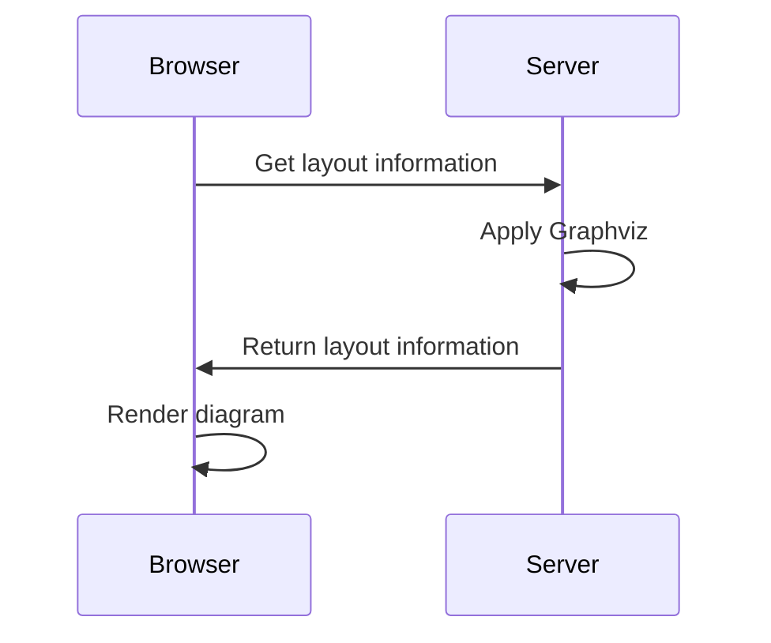

A static site for C4 diagrams from a [Structurizr](https://structurizr.com) workspace.

## Features

- Real Structurizr diagrams — uses the [same diagram renderer](https://github.com/structurizr/ui) as the [official tools](https://docs.structurizr.com/products), and [themes](https://structurizr.com/help/themes) just work.
- Zoom and pan with mousewheel or trackpad (like Google Maps, Lucidchart, Miro, etc).
- Simplified UI with [quick navigation](https://docs.structurizr.com/ui/quick-navigation) and [fuzzy search](https://github.com/farzher/fuzzysort)
- PNG export
- Just the diagrams — [docs](https://docs.structurizr.com/dsl/docs) and [ADRs](https://docs.structurizr.com/dsl/adrs) in the workspace are ignored.
- Customisable nav — link to your own supplemental docs, [ADRs](https://cognitect.com/blog/2011/11/15/documenting-architecture-decisions), source code, etc

## Instructions

- Download and unzip the latest [release](https://github.com/bensmithett/structurizr-mini/releases) somewhere that can serve static files over HTTP
- Put your `workspace.json` in the same place
- Go to `http://[YOUR SERVER]/index.html`

How you get a `workspace.json` depends on your workflow, and the extent to which you're using Structurizr Cloud or [On-Premises](https://docs.structurizr.com/onpremises).

## Structurizr Cloud/On-Premises workflow

Use Structurizr CLI's [`pull`](https://docs.structurizr.com/cli/pull) to [export](https://structurizr.com/help/workspace-export-and-import) a `workspace.json` that includes diagram layout information.

## Structurizr Mini workflow

- Author a `workspace.dsl` locally, using [Structurizr Lite](https://structurizr.com/help/lite) or the [web DSL Editor](https://structurizr.com/dsl) to preview the resulting diagrams.
- Publish diagrams with Structurizr Mini (e.g. as part of a CI build)

The Structurizr CLI can export your `workspace.dsl` to JSON...

```
structurizr-cli export -workspace workspace.dsl -format json
```

... but ⚠️ `workspace.dsl` **does not include any diagram layout info** and the CLI alone will not create it.

### Where does your diagram layout info come from?

Diagram layout is defined two ways: **automatically** and **manually**.

#### Automatic layout (i.e. `autoLayout`)

To get the actual layout information for your `autoLayout` views, Structurizr Lite/Cloud/On-Premises run [Graphviz](https://graphviz.org) on the server when you view a diagram.



As a static site without a server runtime, Mini can't do that. Luckily there's an [easy way](https://github.com/structurizr/cli/issues/62#issuecomment-999623728) to generate automatic layout information at build time:

1. [Install Graphviz](https://graphviz.org/download/) so the `dot` command is available
2. Create a wrapper DSL file (e.g. `graphviz.dsl`) that extends your JSON workspace, and applies graphviz.
```
workspace extends workspace.json {
  !script groovy {
    new com.structurizr.graphviz.GraphvizAutomaticLayout().apply(workspace);
  }
}
```
3. Use the CLI to export *that* workspace to JSON
```bash
structurizr-cli export -workspace graphviz.dsl -format json
```

This JSON workspace will have all the layout information that Structurizr Mini needs to render your `autoLayout` diagrams.

#### Manual layout

If you use Lite to locally edit the layout of non-`autoLayout` diagrams, Lite [auto-saves](https://docs.structurizr.com/lite/usage#auto-save) those edits to a local `workspace.json`.

You may wish to commit this file to version control. It's a `workspace.json` complete with layout information that Mini can use directly.

⚠️ Remember that layout info for a diagram only updates in Lite's `workspace.json` when you *actually view the individual diagram* in the browser. Things can get messy if you have many diagrams, or multiple people contributing changes, each updating their own local `workspace.json` according to which diagrams they view or edit.

If your workspace has a mix of automatic and manual layouts, you can still use the method above to generate automatic layout information for all diagrams based on the latest `workspace.dsl`, regardless of which individual diagrams contributors have viewed recently.

Personally, I just rely solely on `autoLayout` and `.gitignore` the `workspace.json` generated by Lite. 
